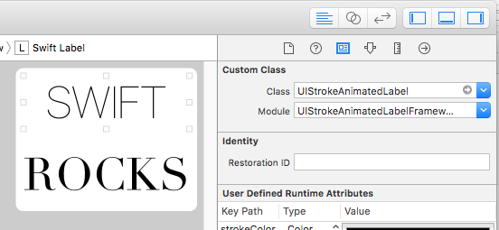
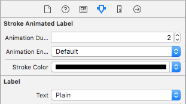

# UIStrokeAnimatedLabel (Swift)
### A UILabel subclass with stroke drawing animations, with customization options

A `UIStrokeAnimatedLabel` is a `UILabel` that has a stroke animation when displayed. 
Animation duration, stroke width and spacing and easily customizable through Interface Builder or programatically.


## Installation

Build and link the `UIStrokeAnimatedLabel` framework (`UIStrokeAnimatedLabel/UIStrokeAnimatedLabelFramework.xcodeproj`).

Alternatively, copy `UIStrokeAnimatedLabel/UIStrokeAnimatedLabel/UIStrokeAnimatedLabel.swift` directly in your project.

## Usage and customization

A `UIStrokeAnimatedLabel` can be created and customized through Interface Builder or programmatically.

### Interface Builder

1. Drag a `UILabel` into a view.
2. Set the label's class to `UIStrokeAnimatedLabel`. You might also need to set the Module name to `UIStrokeAnimatedLabelFramework` if using CocoaPods.

 

Customize the label using the Attributes inspector. From there, animation duration and stroke color can be modified.



### Programmatically

Create `IBOutlet`s or create the labels programatically.

  ```
  @IBOutlet weak var swiftLabel: UIStrokeAnimatedLabel!
  @IBOutlet weak var rocksLabel: UIStrokeAnimatedLabel!

  override func viewDidLoad() {
    super.viewDidLoad()

      swiftLabel.animationDuration = 1.0
      rocksLabel.animationDuration = 2.0

      swiftLabel.strokeWidth = .relative(scale: 1.4)
      rocksLabel.strokeColor = .gray
      swiftLabel.characterSpacing = .absolute(value: 20.0)
      rocksLabel.wordSpacing = .relative(scale: 0.5)

      rocksLabel.animationEnabled = true
      
      rocksLabel.completionHandler = {
        print("Animation complete")
      }
  }

```
##License
MIT, see LICENSE for details.
