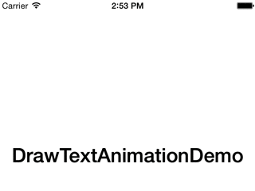
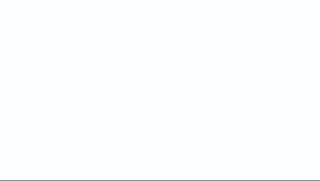

# iOSDrawTextAnimation (Swift)
####A text drawing animation for iOS written in Swift

I wanted to make good use of the `CTFontCreatePathForGlyph` function from CoreText, so decided to make a simple drawing animation that works with any string and any font.

The following parameters are customizable:

- Text
- Font
- Spacing between characters
- Spacing between words
- Duration
- Border width
- Border color
- Enclosing view

##Demo
----------
Using the Avenir Next Ultra Light font, size 50

Using Didot, size 50

##Usage
----
You will have to import the `StrokeAnimator.swift` file into your project.

To perform an animation, call `performStrokeAnimation` like so:
	
	performStrokeAnimation(text: "SWIFT",
						   font: swiftFont,
						   characterSpacing: 20.0,
						   wordSpacing: 40.0,
						   duration: 4.0,
						   borderWidth: 1.0,
						   borderColor: color,
						   inView: swiftBox)

or simply

	performStrokeAnimation(text: "SWIFT", font: swiftFont, inView: swiftBox)

An example is provided in `ViewController.swift`.

The text is centered in the view passed in as a parameter. 

Have fun!

##License
MIT, see LICENSE for details.

# UIStrokeAnimatedLabel (Swift)
### A UILabel subclass with stroke drawing animations, with customization options

A `UIStrokeAnimatedLabel` is a `UILabel` that has a stroke animation when displayed. Animation duration, stroke width and spacing and easily customizable through Interface Builder or programatically.

## Usage and customization

